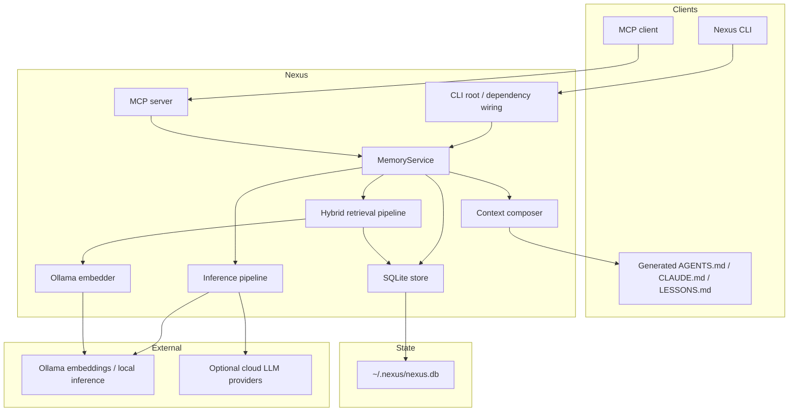

# Nexus High Level Design

**Version:** V0/MVP  
**Status:** Complete, preparing V1  
**Last updated:** 2026-05-18

## 1. Overview

Nexus is a local-first personal context engine for AI-assisted work. It persists user, project, workflow, and coding memory in a local SQLite store, ranks that memory through hybrid retrieval, and exposes ready-to-inject context through CLI and MCP tools.

The V0 design deliberately optimizes for:

- local ownership of memory
- a small Go binary
- explicit context composition
- clear storage/retrieval/inference boundaries
- compatibility with MCP clients

## 2. Current V0 Scope

Implemented:

- structured memories with six categories
- stable/dynamic memory layering through `metadata.layer`
- SQLite storage with migrations, WAL, FTS5, and JSON metadata
- local embeddings through Ollama
- hybrid retrieval: semantic + recency + category + confidence
- effective confidence with access reinforcement and time decay
- profile layer: archetypes, personas, sessions, projects
- persona resolver with primary/blend/broad/cold-start modes
- two-layer context composition with token budgets
- LLM transcript inference through `ollama`, `lmstudio`, `anthropic`, `openai`, and `gemini`
- MCP server with canonical `nexus_*` tools
- prior health inspection through `nexus priors --status`
- live store retrieval benchmark mode
- generation of `CLAUDE.md`, `AGENTS.md`, and `LESSONS.md`

Out of V0 scope:

- browser extension
- automatic activity capture
- always-on context injection
- remote sync
- team or enterprise memory
- graph/temporal reasoning beyond the current profile tables

## 3. Component Diagram



## 4. Package Boundaries

Key packages:

- `internal/memory` - domain types, layers, confidence model, vector helpers
- `internal/app` - use cases: add, search, context, inference, profiles, priors, lessons
- `internal/retrieval` - hybrid scoring pipeline behind interfaces
- `internal/storage/sqlite` - SQLite persistence and migrations
- `internal/embeddings/ollama` - embedding client
- `internal/inference` - LLM provider abstraction
- `internal/mcp` - MCP tool registration and handlers
- `internal/cli/commands` - CLI command surface
- `internal/config` - environment-backed configuration

The app layer depends on interfaces, not concrete SQLite or Ollama implementations. This is the core low-level design choice that keeps storage, retrieval, and inference replaceable.

## 5. Memory Model

Core memory fields:

- `id`
- `category`
- `content`
- `source`
- `confidence`
- `tags`
- `embedding`
- `access_count`
- `valid_from`
- `valid_until`
- `metadata`
- timestamps

Categories:

- `FACT`
- `PREFERENCE`
- `WORKFLOW`
- `PROJECT`
- `CODING_STYLE`
- `INFERRED`

Layers:

- `stable` - durable identity, preferences, coding style, recurring workflows
- `dynamic` - active projects, tasks, current focus, temporary state

Layers are stored in `metadata.layer`, with stable/dynamic views and FTS support in SQLite. The single-table design preserves backward compatibility and avoids a destructive stable/dynamic table split.

## 6. Profile Model

V0 profile tables:

- `archetypes`
- `personas`
- `sessions`
- `projects`

Built-in archetypes:

- `sre_infra`
- `cs_student`
- `startup_builder`
- `fullstack_dev`
- `ml_ai_engineer`
- `product_manager`

Persona resolution uses:

- archetype keyword matches
- matching memory retrieval results
- persona centroid embeddings when available

Resolution modes:

- `primary`
- `blend`
- `broad`
- `cold_start`

## 7. Retrieval Pipeline

Retrieval flow:

1. Embed query through Ollama when available.
2. Fetch lexical candidates through FTS5.
3. Fetch recent vector candidates with a capped scan.
4. Merge and deduplicate candidates.
5. Score each candidate.
6. Sort, cap, and record access.

Score formula:

```text
final =
  semantic_weight   * semantic_score +
  recency_weight    * recency_score +
  category_weight   * category_score +
  confidence_weight * effective_confidence
```

Default weights:

```text
semantic   0.45
recency    0.25
category   0.20
confidence 0.10
```

`GetAllWithEmbeddings` is capped at 2000 candidates in V0 to avoid unbounded allocation. V3 can replace this with ANN indexing.

## 8. Context Composition

`ComposeContext` produces a stable + dynamic context block for an intent.

Inputs:

- intent
- optional persona id
- stable token budget
- dynamic token budget
- stable/dynamic limits

Filtering considers:

- persona resolution
- secondary personas in blend mode
- focused project IDs
- whether the intent asks for broad project context
- layer-specific token budgets

The result is returned as structured JSON and formatted text suitable for injection into AI clients.

## 9. Inference Pipeline

`nexus infer` and `nexus_infer` extract durable memories from a transcript.

Flow:

1. Read transcript text, JSON export, or SQLite conversation export.
2. Call configured LLM provider.
3. Parse extracted memory JSON.
4. Clamp category/layer/confidence.
5. Resolve persona.
6. Upsert memories with deduplication.
7. Update archetype prior confidence where supported.
8. Record session.
9. Update persona activation and centroid.

Supported providers:

- `ollama`
- `lmstudio`
- `anthropic`
- `openai`
- `gemini`

Cloud providers require `NEXUS_INFERENCE_API_KEY` when writes are enabled.

## 10. Prior Health

Archetype priors are seeded as normal memories with `archetype` tags. `nexus priors --status` classifies them as:

- `pending`
- `reinforced`
- `unreinforced`
- `stale`
- `contradicted`

The inference pipeline stamps prior signal metadata when it reinforces or contradicts a prior. This gives V0 basic visibility into stale assumptions before the V2 reflection pipeline exists.

## 11. MCP Surface

Canonical MCP tools:

- `nexus_search`
- `nexus_get_context`
- `nexus_get_project_context`
- `nexus_get_workflow_profile`
- `nexus_add`
- `nexus_infer`
- `nexus_list`
- `nexus_delete`
- `nexus_stats`

The MCP server supports:

- stdio transport for code agents
- SSE transport for HTTP-style clients

## 12. CLI Surface

Important commands:

- `add`
- `search`
- `context`
- `infer`
- `ingest`
- `init`
- `resolve`
- `workflow-profile`
- `priors --status`
- `generate`
- `lessons`
- `list`
- `delete`
- `stats`
- `embed`
- `serve`
- `version`

## 13. Storage

SQLite uses:

- pure Go `modernc.org/sqlite`
- WAL mode
- FTS5 virtual table
- transactional migrations
- JSON metadata/tags
- BLOB-encoded `[]float32` embeddings

Default database:

```text
~/.nexus/nexus.db
```

Example Windows path:

```text
C:\Users\<you>\.nexus\nexus.db
```

## 14. Verification

Standard compile checks:

```powershell
go test ./...
go vet ./...
```

Build:

```powershell
go build -o bin\nexus.exe .\cmd\nexus
```

MCP smoke:

```powershell
go run .\scripts\mcp_smoke.go
```

Live retrieval benchmark:

```powershell
go run .\benchmarks\runner\main.go --version live-v0-local --live --live-queries 8
```

Project convention: do not add Go `*_test.go` files unless explicitly approved.

## 15. V1 Direction

V1 should focus on the product loop:

```text
observe activity -> infer memory -> retrieve relevant context -> inject compact context
```

Likely V1 work:

- REST API for local clients
- automatic session/activity capture
- client-side context retrieval before agent turns
- lightweight viewer or inspection surface
- improved benchmark corpus beyond self-recall
- packaging and install ergonomics
